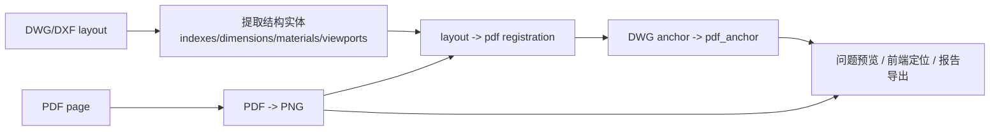

# PDF-DWG 坐标配准设计

**日期：** 2026-03-08

## 背景

当前系统存在两套不同的坐标源：

- 审核语义源：`DWG/DXF layout` 提取出的索引、尺寸、材料、title block、viewport
- 用户展示源：上传的 `PDF` 转成 `PNG` 后的页面图像

这导致一个根本问题：即使后端在 DWG 中找到了正确实体，也不一定能稳定投影到当前展示的 PDF 页面上。已经验证的真实案例表明：

1. 一部分问题来自后端坐标映射错误，例如把 layout 坐标映射到 viewport 包围盒而不是整张纸面。
2. 更深层的问题是“审核锚点坐标系”和“用户查看图像坐标系”并不统一。
3. 如果继续只修百分比公式，定位仍会在部分图纸、部分版本、部分出图条件下失真。

同时，完全切回 DWG 直接渲染也不可接受，因为视觉真值仍然应以设计师导出的 PDF 为准，DWG 直接渲染在字体、图层、代理对象、打印样式上不稳定。

## 目标

构建统一的“问题最终展示坐标系”：

- 用户查看、AI 裁图、问题定位、报告导出全部基于 `PDF page` 坐标
- DWG/DXF 继续作为结构语义来源
- 在两者之间建立可追溯的 `layout -> pdf page` 配准关系

## 非目标

- 不把最终审阅面切回 DWG 直接渲染
- 不放弃 DWG/DXF 的结构信息，完全依赖 OCR/视觉识别
- 不在前端做坐标猜测补偿

## 设计原则

1. **PDF 是展示真值**
   - 用户最终看到的页面必须与定位坐标同源
2. **DWG/DXF 是语义真值**
   - 结构化审核优先使用 DWG/DXF 实体，而不是重做视觉识别
3. **Registration 是桥**
   - 任何要展示给用户的锚点，必须先被转换为 `pdf_anchor`
4. **统一输出坐标**
   - 前端与报告层只消费 `pdf_anchor`
5. **保留置信度**
   - 配准和锚点来源必须带 `confidence`

## 方案比较

### 方案一：统一切回 DWG 直接渲染

优点：
- 坐标天然同源
- 不需要 registration

缺点：
- 图层、字体、代理对象、打印样式不稳定
- 与用户实际审图页面不一致

结论：不采用。

### 方案二：统一基于 PDF/PNG 做视觉识别

优点：
- 展示和定位同源

缺点：
- 结构类问题能力大幅下降
- 索引、尺寸、材料、反向索引链等审核会变脆弱

结论：不采用。

### 方案三：PDF 做展示真值，DWG/DXF 做语义真值，增加 registration 层

优点：
- 保留 DWG 自动审核能力
- 用户看到的永远是最终出图效果
- 定位可以统一落到 PDF 页面

缺点：
- 需要新增配准数据模型和变换流程

结论：采用。

## 核心架构

## 数据模型

### 1. layout 配准记录

建议新增表 `drawing_layout_registrations`：

- `id`
- `project_id`
- `drawing_id`
- `drawing_data_version`
- `sheet_no`
- `layout_name`
- `pdf_page_index`
- `layout_page_range_json`
- `pdf_page_size_json`
- `transform_json`
- `registration_method`
- `registration_confidence`
- `created_at`
- `updated_at`

说明：

- `transform_json` 至少支持平移和缩放；设计上保留仿射扩展能力
- `layout_page_range_json` 记录 DWG layout 纸面坐标
- `pdf_page_size_json` 记录 PDF/PNG 页面像素尺寸

### 2. 审核锚点统一输出

现有 `audit_issue_drawings.anchor_json` 扩展为：

- `layout_anchor`
- `pdf_anchor`
- `origin`
- `confidence`

其中：

- `layout_anchor`：DWG/DXF 原始实体锚点
- `pdf_anchor`：通过 registration 转换后的最终展示锚点
- 前端只使用 `pdf_anchor`

## 配准策略

### 一级：直接纸面配准

适用于规则图幅、图框完整、layout 与 PDF 页面一一对应的情况。

使用：

- layout `limmin/limmax` 或 `paper_width/paper_height`
- PDF 页面像素宽高

变换：

- `x_pdf = (x_layout - min_x) / layout_width * pdf_width`
- `y_pdf = (1 - (y_layout - min_y) / layout_height) * pdf_height`

这是默认和首选路径。

### 二级：图框/图签校准

适用于 PDF 页面存在页边距、裁切、拼页、图签栏额外占位的情况。

使用这些稳定锚点进行校准：

- 图框四角
- 图签框
- title block
- viewport 边界
- 页码/图号/图名区域

输出更精确的缩放和平移参数。

### 三级：局部实体验证

适用于索引、尺寸、材料等细粒度定位：

- 用 DWG 提供结构实体
- 用 PDF 局部裁图验证目标附近是否存在对应文本/符号
- 若验证失败，降低 `confidence`

## 问题类型接入策略

### 第一批优先接入

- 索引问题
- 结构化尺寸问题
- 结构化材料问题

### 第二批接入

- AI 视觉问题
- 多页引用问题
- 复杂反向链问题

## 前端策略

前端不再直接消费 `layout/global_pct`，统一消费：

- `pdf_anchor.global_pct`

并新增 UI 行为：

- `confidence >= 0.9`：直接精确十字定位
- `0.6 <= confidence < 0.9`：定位并提示“估计位置”
- `< 0.6`：不显示十字，只显示“关联区域可能存在问题”

## AI 审核影响

### 当前风险

如果 AI 或规则结果最终仍落在 DWG 坐标，而 UI 展示的是 PDF 页面，则：

- 结构问题定位会继续漂移
- 局部裁图和复核截图会错位
- 训练样本会被污染

### 目标状态

所有审核结果最终都产出 `pdf_anchor`：

- 视觉类问题：天然在 PDF 坐标中
- 结构类问题：DWG 锚点经 registration 转为 PDF 锚点

这样 AI 审核和人工查看才能使用同一坐标系。

## 风险与应对

### 1. 某些 DWG layout 与 PDF 页并非一一对应

处理：
- registration 记录必须保存 `layout_name -> pdf_page_index`
- 若存在多 layout 合并到一页，先标记为不支持并降级

### 2. 老项目只有旧 JSON，没有 `layout_page_range`

处理：
- 读取 preview 时按源 DWG 自动回填
- 回填失败则降级为 bbox 估算并降低置信度

### 3. PDF 页视觉与 DWG 实体不一致

处理：
- 保留 `origin` 和 `confidence`
- 允许结果存在 `layout_anchor` 但缺失可靠 `pdf_anchor`

## 验收标准

1. 同一条问题在 UI、导出报告、复核截图中显示同一位置
2. PDF 页面是唯一展示基准
3. 新上传版本不会污染旧审核的定位记录
4. 至少索引问题在真实项目样本中可稳定落到正确 PDF 位置
5. 锚点数据可追溯到 `layout_anchor -> registration -> pdf_anchor`

## 结论

最优方案不是“切回 DWG 渲染”，也不是“纯 PDF 视觉识别”，而是：

**以 PDF 为最终展示真值，以 DWG/DXF 为语义真值，通过 registration 把所有结构化审核结果统一投影到 PDF 坐标。**

后续所有定位与 AI 审核结果应以 `pdf_anchor` 作为唯一对外展示坐标。
