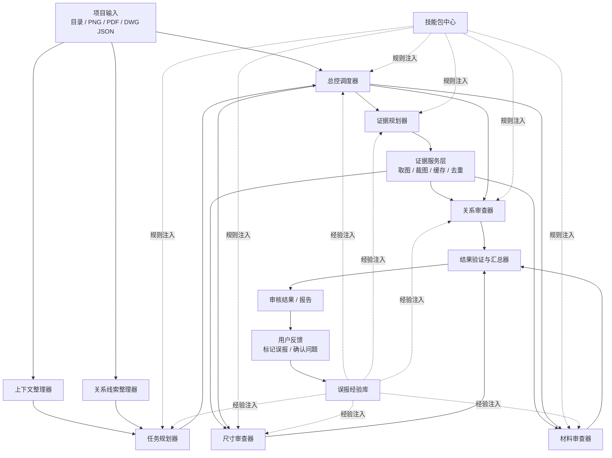

# AI 审图总控架构设计

## 目标

把当前“多个 AI 审查模块各自拿图就开始跑”的固定流水线，升级成“总控调度 + 证据规划 + 专用审查器 + 用户反馈闭环”的任务驱动架构。

这次设计重点解决 4 个问题：

1. 图片发送过于盲目，缺少统一调度。
2. 每个模块各自决定取图方式，重复渲染、重复上传严重。
3. 技能包只停留在提示词层，没有真正进入规划和执行策略。
4. 用户误报意见没有形成运行时可用的闭环经验。

## 设计原则

- 先规划，再取图，不允许默认大批量喂图。
- 图像是证据，不是默认输入。
- 技能包既参与规划，也参与执行。
- 误报经验既参与规划，也参与执行，但只有用户确认后才能入库。
- 审查器只负责领域判断，不负责决定一次看多少图。

## 分层架构

### 1. 输入与经验层

- 项目输入
  - 目录
  - PNG
  - PDF
  - DWG JSON
- 技能包中心
  - 规则偏好
  - 证据策略
  - 判定口径
- 误报经验库
  - 用户确认过的误报样本
  - 误报模式
  - 纠偏策略

### 2. 规划层

- 总控调度器
  - 决定本轮要查什么、先查什么、哪些需要图像
  - 管理视觉预算、并发预算、复核策略
- 上下文整理器
  - 把目录、图纸分类、JSON 摘要、已有关系整理成可规划的上下文
- 关系线索整理器
  - 提供关系类候选线索，不直接产出最终问题
- 任务规划器
  - 生成候选审查任务
  - 受技能包和误报经验影响
- 证据规划器
  - 决定每个任务取哪些图、哪些裁图、分几轮看
  - 受技能包和误报经验影响

### 3. 执行层

- 证据服务层
  - 统一取图
  - 统一裁图
  - 统一缩放
  - 统一缓存
  - 统一去重
- 关系审查器
- 尺寸审查器
- 材料审查器

三个审查器平级，都是执行 Worker。它们只消费总控与证据规划器下发的任务与证据包，不再自己决定大规模取图。

### 4. 验证与反馈层

- 结果验证与汇总器
  - 检查输出是否合法
  - 检查证据是否充分
  - 决定是否需要补复核
- 审核结果 / 报告
- 用户反馈
  - 标记误报
  - 确认问题
  - 留备注
- 误报经验回写
  - 只有用户反馈确认后，才写入误报经验库

## 正式结构图

## 各模块职责边界

### 总控调度器

职责：

- 接收项目级输入、技能包、误报经验。
- 给任务规划器和证据规划器下发本轮目标。
- 控制并发和视觉预算。
- 控制失败后的降级和重试。

不负责：

- 直接做领域审查。
- 直接生成图片。

### 关系线索整理器

职责：

- 从目录、JSON、已有关系里整理候选关系线索。
- 给任务规划器提供“可能需要关系核对”的候选对象。

分工边界：

- 上下文整理器负责项目级、通用型上下文整理，例如图纸分类、目录状态、JSON 摘要、基础结构信息。
- 关系线索整理器负责关系领域特定线索提取，例如索引引用、详图跳转、剖面关联等，只服务关系类任务规划。

不负责：

- 最终判定关系问题。

### 任务规划器

职责：

- 把项目转成候选任务集合。
- 判断哪些任务值得执行，优先级如何。

输入：

- 上下文
- 关系线索
- 技能包
- 误报经验

### 证据规划器

职责：

- 决定每个任务要不要图。
- 决定看全图还是局部图。
- 决定一轮看几张图，是否需要多轮复查。

输入：

- 总控任务目标
- 技能包
- 误报经验

输出：

- 标准化证据请求单

### 证据服务层

职责：

- 执行证据请求单。
- 统一负责 PDF 渲染、裁图、缩放、复用缓存。
- 对重复请求去重。

这是所有审查器共享的底层，不允许每个审查器自行实现一套取图逻辑。

### 三个审查器

共同职责：

- 根据领域规则完成判断。
- 结合技能包修正提示词和判定口径。
- 结合误报经验调整阈值、降级策略和复核要求。

关系审查器：

- 处理索引、详图、剖面、跨图引用问题。

尺寸审查器：

- 处理尺寸语义提取、尺寸冲突、图对比。

材料审查器：

- 处理材料表与图面用料的一致性问题。

### 结果验证与汇总器

职责：

- 统一做结果结构校验。
- 统一做证据充分性校验。
- 统一做冲突消解与补复核决策。

不负责：

- 直接写入误报经验库。

### 用户反馈

职责：

- 标记误报
- 确认问题
- 填写备注

只有这里的结果，才能进入误报经验库。

## 技能包中心的角色

技能包不再只是提示词文本，而应拆成三类能力：

1. 任务偏好
- 哪类项目优先查什么
- 哪类问题可以跳过或降级

2. 证据策略
- 某类任务通常先看哪些图
- 是否需要先全图再局部
- 是否要求双图交叉验证

3. 判定口径
- 什么情况算错误
- 什么情况只算提醒
- 哪些项目有特殊规范

技能包注入到：

- 总控调度器
- 任务规划器
- 证据规划器
- 三个审查器

## 误报经验库的角色

误报经验库不只是训练样本库，而是运行时策略输入。

### 经验库输入来源

只来自用户反馈：

- 用户标记误报
- 用户确认问题
- 用户给出补充备注

### 经验库运行时作用

注入规划层：

- 决定任务优先级
- 决定是否降级
- 决定是否需要更多证据

注入执行层：

- 调整置信度阈值
- 调整 error / warning / 待复核 的输出门槛
- 触发二次复核而不是直接报错

### 经验库存储建议

至少存两类对象：

1. 误报模式
- 哪类问题高误报
- 适用范围

2. 纠偏策略
- 提高阈值
- 降级为 warning
- 必须补局部图
- 必须二次复核

## 证据策略建议

定义标准证据包，不再允许各模块自由扩图：

### 全图包

- 1 张全图
- 用于粗分类、粗判断

### 双图全图包

- 2 张全图
- 用于跨图关系和尺寸对比初筛

### 焦点证据包

- 1 张全图
- 1 到 2 张局部图
- 用于确认单个疑点

### 深度证据包

- 1 张全图
- 多张局部高清图
- 仅对少量高价值任务使用

## 与当前系统的主要差异

当前系统的问题：

- 关系发现默认固定组图，先大量发图再让 AI 理解。
- 尺寸审核默认走固定五图套餐，再走固定图对套餐。
- 材料审核按任务直接并发发送，没有统一证据预算。
- 技能包和误报经验没有统一进入调度逻辑。

新架构的变化：

- 先做候选任务规划。
- 再做证据规划。
- 再由证据服务层统一取图。
- 审查器只执行，不负责盲目扩图。
- 用户反馈闭环进入误报经验库，反向影响下一轮执行。

## 迁移建议

### 第 1 阶段：补证据服务层最小版

- 先统一取图入口。
- 先做缓存、去重、渲染复用。
- 暂时不强行把取图决策权从审查器里拿走。

这一阶段的目标不是改变“看什么图”，而是先止住重复渲染、重复裁图、重复上传。

### 第 2 阶段：证据规划器与证据服务层联动落地

- 这一阶段应与第 1 阶段连续推进，最好并行设计、衔接上线。
- 从这里开始，逐步把“取什么图”的决策权从审查器收回到证据规划器。
- 建议先选一个模块试点，例如关系审查器。

这一阶段完成后，系统才真正开始从“固定图片套餐”转向“按任务选择证据包”。

### 第 3 阶段：总控调度器接入证据规划

- 让总控不只分发任务，还能约束视觉预算和复核策略。
- 形成“先规划，再取图”的主链路。

### 第 4 阶段：让技能包进入规划层和执行层

- 技能包不只改提示词。
- 同时影响任务优先级、证据策略和判定口径。

### 第 5 阶段：让误报经验进入执行层

- 三个审查器都能基于经验调整阈值和复核策略。
- 运行时经验真正进入最终判定链路。

### 第 6 阶段：补用户反馈闭环

- 审核结果页增加明确的误报标记入口。
- 用户反馈进入误报经验库。
- 形成可持续学习闭环。

## 最终判断

正确方向不是继续调 group size、并发数和图片套餐，而是把系统升级为：

- 总控调度
- 证据规划
- 统一证据服务
- 专用审查器执行
- 用户反馈驱动的误报闭环

这样才能让 AI 从“盲目吃图”转成“按任务拿证据”。
