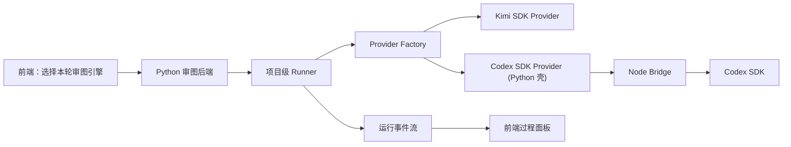

# Codex SDK 接入现有审图 Runner 并支持前端切换设计

**背景**

当前审图系统已经有一套项目级 Runner 架构，底下主要接的是 Kimi 相关 provider。

现在的新需求是：

- 在现有 Kimi SDK 之外，再支持 **Codex SDK**
- 前端可以随时切换：
  - 用 `Kimi SDK`
  - 或用 `Codex SDK`
- 这个切换不能破坏现有的：
  - 项目级 Runner
  - 子会话池
  - 审图事件流
  - 结构化 Finding
  - 预算 / 热点图 / 输出守门

用户还特别关心一点：

- 不想每次都改环境变量重启后端
- 希望在前台就能切换这一轮审图到底用哪个 AI 引擎

---

## 现状判断

### 1. 当前 Runner 架构已经有 provider 抽象

现在 Python 后端已经有：

- `ProjectAuditAgentRunner`
- provider factory
- Kimi API / CLI / SDK provider

这说明：

**架构上已经为“多引擎”留出了口子。**

所以这次不是要推翻现有 Runner，而是要在这个入口下再加一条新 provider 路。

### 2. Codex SDK 本身不是 Python SDK

官方文档和仓库说明很明确：

- Codex SDK 主体是 `TypeScript / Node.js`
- 典型形态是：
  - `new Codex()`
  - `startThread()`
  - `run()`
  - `resumeThread()`

这和我们现在的 Python 后端不在同一语言栈里。

所以现实约束是：

**Codex SDK 不能像 Kimi SDK 那样直接塞进现有 Python provider。**

### 3. 但它的会话模型非常适合现有 Runner

Codex SDK 自带：

- thread
- resume
- streaming

而我们现在的 Runner 也正好是：

- 项目级 Runner
- Agent 子会话池
- 流式事件桥接

所以从模型上看，两边其实很合拍。

一句大白话：

**语言栈不一样，但会话思路是一样的。**

---

## 方案比较

### 方案 A：继续只用 Kimi，不接 Codex

优点：

- 没有新增复杂度
- 不需要加新桥接层

缺点：

- 无法做引擎切换
- 不能验证 Codex 在审图任务上的效果
- 用户提出的新需求无法满足

**结论：不符合当前目标。**

### 方案 B：在 Python 里直接“硬接” Codex SDK

做法：

- Python 直接 shell 调 Node
- 或者硬包一层命令行调用

优点：

- 代码路径看起来短

缺点：

- 很快会变成难维护的“跨语言拼接”
- thread / stream / resume / cancel 都会很别扭
- 不适合后续扩展和稳定运行

**结论：不推荐。**

### 方案 C：保留 Python Runner，总线下面增加 Node bridge，再接 Codex SDK

做法：

- Python 继续负责主审图编排
- 新增一个本地 Node bridge
- Node bridge 里真正接 Codex SDK
- Python provider 只负责和 bridge 通信

优点：

- 保留现有 Runner 架构
- 让 Codex SDK 走自己最自然的语言环境
- thread / stream / resume / cancel 更容易做对
- 前端切换时只是在 provider 层换引擎

缺点：

- 新增一个本地服务层
- 实现量中等偏大

**结论：推荐。**

---

## 推荐方案

采用 **方案 C：Python Runner + Node bridge + Codex SDK**。

一句大白话：

**不是把 Codex SDK 硬塞进 Python，而是在现有 Runner 下面加一个 Node 小桥，让 Codex 走自己擅长的路。**

这样我们能同时保住：

- 现有审图主链
- Kimi SDK 路线
- 未来多引擎扩展能力

---

## 新架构

---

## 核心设计

### 1. Runner 不变，Provider 扩展

这次不改 Runner 的总职责。

它继续负责：

- 项目级公共入口
- 子会话池
- 输出守门
- 流式事件桥接
- 在线监督

变化点只在下面这一层：

- 原来只接 Kimi 相关 provider
- 现在再加一个 `CodexSdkProvider`

也就是说：

**业务 Agent 不关心底层是 Kimi 还是 Codex。**

它们还是只跟 Runner 说话。

### 2. 新增 `CodexSdkProvider`

这个 provider 不直接在 Python 里跑 SDK。

它的职责是：

- 把一次 Runner turn 转成 bridge 请求
- 把 bridge 返回的流式事件转回：
  - `provider_stream_delta`
  - `phase_event`
  - `runner_broadcast`
- 把 thread / session 信息映射回当前子会话

所以它本质上是：

**Python 侧的 Codex 代理壳。**

### 3. 新增本地 `Node bridge`

这是整次接入的关键。

这个 bridge 负责：

- 初始化 Codex SDK
- 创建 thread
- 继续 thread
- 读取流式输出
- 暴露 cancel / resume
- 把结果整理成稳定的桥接协议

大白话：

**Codex SDK 的脏活、细活，都放到 Node 里做。**

### 4. 前端切换不是全局环境变量，而是“审核级设置”

这个点非常重要。

推荐分两层：

#### 系统默认值

设置页可以有默认引擎：

- `Kimi SDK`
- `Codex SDK`

#### 本次审核覆盖值

启动审核时可以单独选：

- 这轮用 `Kimi SDK`
- 这轮用 `Codex SDK`

也就是说：

**引擎切换应该绑定到“这一轮审核”，而不是只绑定到服务器环境变量。**

这样更适合实际测试。

---

## 数据流

### 启动审核时

1. 前端发起“开始审核”
2. 请求里带上本轮引擎选择：
   - `runner_provider = kimi_sdk`
   - 或 `runner_provider = codex_sdk`
3. 后端创建本轮 `AuditRun`
4. Runner 初始化时读取本轮 provider 选择

### 业务 Agent 调 AI 时

1. 业务 Agent 调 Runner
2. Runner 找到本轮 provider
3. 如果是：
   - `kimi_sdk` → 走现有 Kimi SDK provider
   - `codex_sdk` → 走 Python `CodexSdkProvider`
4. `CodexSdkProvider` 调本地 Node bridge
5. bridge 再真正调 Codex SDK

### 流式输出时

1. Codex SDK 吐流
2. Node bridge 整理成统一事件
3. Python provider 转成现有 Runner 事件
4. Runner 再转成：
   - 前端播报层
   - 观察层
   - 调试层

---

## 会话模型

这里仍然沿用现有设计：

- 一个项目一轮审核 = 一个项目级 Runner
- 每个业务 Agent = 一个子会话

如果本轮引擎是 `codex_sdk`：

- 每个子会话在 Node bridge 里对应一个 thread
- thread id 要回传给 Python
- Python 再绑到当前 `RunnerSubsession`

这样就能做到：

- 总控规划Agent 有自己的 Codex thread
- 关系审查Agent 有自己的 Codex thread
- 尺寸审查Agent 有自己的 Codex thread

但它们仍然都属于同一轮审核。

---

## 事件模型

这次不新造一套全新的事件名，尽量贴现有 Runner。

统一原则：

- `phase_event`：业务阶段说明
- `provider_stream_delta`：provider 原始增量
- `runner_broadcast`：前端默认看的大白话播报

Codex SDK 接入后，只要桥接层整理好，前端理论上不需要知道底层已经换成了 Codex。

也就是说：

**前端看的是同一套 Runner 事件，不看具体 SDK 品牌。**

---

## 为什么不直接让前端知道具体底层引擎

默认不建议在普通界面直接暴露：

- “这是 Kimi”
- “这是 Codex”

原因很简单：

- 用户真正关心的是审图有没有顺利跑
- 不是底层品牌

所以更合理的是：

- 默认只显示：`AI 引擎`
- 调试层或设置页里再展示真实 provider

---

## 需要新增的核心组件

### 后端（Python）

- `services/audit_runtime/providers/codex_sdk_provider.py`
- `services/audit_runtime/providers/factory.py` 扩展
- `services/audit_runtime/codex_bridge_client.py`

### 本地 Node bridge

- `codex-bridge/package.json`
- `codex-bridge/src/server.ts`
- `codex-bridge/src/session-store.ts`
- `codex-bridge/src/event-adapter.ts`

### 前端

- 启动审核弹层增加引擎选择
- 设置页增加默认引擎
- 审核过程面板显示本轮 provider 摘要（调试层）

---

## 风险和边界

### 风险 1：多语言桥接复杂度上升

这次会引入：

- Python
- Node
- SDK

所以桥接协议一定要定稳，不然排查会很痛。

### 风险 2：本地环境依赖更复杂

如果要跑 Codex SDK，本地至少要有：

- Node 18+
- `@openai/codex-sdk`
- 可用的 OpenAI 凭证

### 风险 3：流式事件风格可能和 Kimi 不同

这意味着 bridge 层必须做归一化。

不能让前端因为底层换引擎，就看到完全不同风格的流。

---

## 不做什么

这次明确不做：

- 不推翻现有 Python Runner
- 不让前端直接连 Codex SDK
- 不在第一版就废掉 Kimi SDK
- 不做品牌级深度展示，让普通用户去理解哪个引擎差异

一句话：

**先做“可切换”，不做“全迁移”。**

---

## 验收标准

### 功能层

1. 启动审核时，前端可以选择本轮引擎：
   - `Kimi SDK`
   - `Codex SDK`

2. 后端能根据本轮选择，走到正确 provider。

3. Codex SDK 路线可以：
   - 创建 thread
   - 继续 thread
   - 流式输出
   - 取消当前 turn

4. 前端默认视图仍然看 Runner 播报，不直接看原始 SDK 碎片。

### 边界层

1. 业务 Agent 里不直接出现 Codex SDK 调用
2. Codex 相关调用只允许出现在：
   - Node bridge
   - Python `CodexSdkProvider`

### 运行层

1. 同一项目同一轮审核里，不同 Agent 子会话能并发跑
2. 不会因为切到 Codex，就破坏原有 Runner 的子会话池
3. 真实验收报告里能明确写出：
   - 本轮 provider
   - 子会话数量
   - 重试次数
   - `needs_review` 数量

---

## 一句话总结

**这次不是把 Codex SDK 硬塞进现有 Python 后端，而是在现有 Runner 下面加一个 Node bridge，让前端能按“本轮审核”切换 Kimi SDK 或 Codex SDK。**
