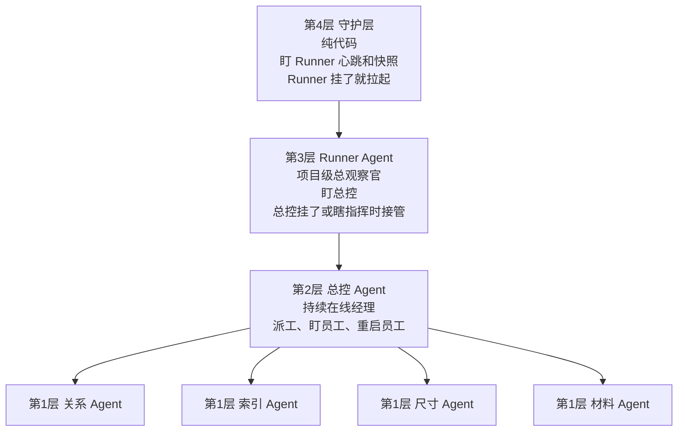

# 分层自救审图架构设计

**目标**

把当前审图系统升级成一套“层层兜底、带记忆重启、尽量不断链”的分层自救架构。

这次设计的核心不是单纯多加几次重试，而是明确：

- 谁负责救谁
- 每层带什么记忆去重启下一层
- 哪种故障只影响局部，哪种故障才允许升级
- 怎样避免“小问题一来就整轮失败”

---

## 一句话结论

这套架构最终要变成 4 层金字塔：

1. **子 Agent 层**
   关系 / 索引 / 尺寸 / 材料这些干具体审图的员工

2. **总控 Agent 层**
   持续在线的现场经理，负责盯子 Agent、重启子 Agent、重排任务

3. **Runner Agent 层**
   项目级总观察官，负责盯总控、重启总控、维护项目级长期记忆

4. **守护层**
   纯代码值班层，不接 AI，只负责盯 Runner、保存快照、拉起 Runner

一句大白话：

**员工出事找经理，经理出事找 Runner，Runner 出事找纯代码保安。**

---

## 这次做什么，不做什么

### 做什么

- 定义 4 层分工
- 定义每层职责边界
- 定义每层的记忆粒度
- 定义每层的心跳 / 快照 / 恢复逻辑
- 定义“往上升级”的触发条件
- 定义哪些情况不能直接把整轮收死

### 不做什么

- 这份文档不直接改代码
- 这份文档不直接改前端 UI
- 这份文档不引入新模型或新依赖
- 这份文档不开放项目工作区之外的权限

---

## 金字塔总览

---

## 每层职责边界

| 层级 | 角色 | 主要职责 | 不该做什么 | 往上升级时机 |
|---|---|---|---|---|
| 第4层 | 守护层 | 盯 Runner 是否存活、写心跳检查、保存/恢复 Runner 快照、Runner 挂了就拉起 | 不看图、不做 AI 判断、不改审图结论 | Runner 无心跳、Runner 进程消失、Runner 快照长时间不可读 |
| 第3层 | Runner Agent | 盯总控、维护项目级长期记忆、重启总控、整理整轮运行总结 | 不直接长期替代总控派工、不深入单条图纸细节 | 总控挂了、总控失忆、总控长时间不推进、总控行为异常 |
| 第2层 | 总控 Agent | 派工、持续带班、收子 Agent 日报、重启子 Agent、重排任务、保证整轮推进 | 不直接替子 Agent 做长期业务判断；不越级去救 Runner | 子 Agent 单任务失败、局部卡住、输出不稳、重复求助 |
| 第1层 | 子 Agent | 具体审图、产出问题、写日报给总控 | 不能宣布整轮失败；不能直接触发人工接管 | 输出不稳、局部任务失败、当前批次拿不准 |

---

## 最关键的设计原则

### 原则 1：下层故障，优先由上一层处理

也就是：

- 子 Agent 出问题，先由总控处理
- 总控出问题，先由 Runner 处理
- Runner 出问题，再由守护层处理

不能一有波动就直接把整轮判死。

### 原则 2：重启必须带记忆，不准裸重启

每层重启下一层时，都必须带上对应粒度的记忆：

- 总控重启子 Agent：带任务级记忆
- Runner 重启总控：带项目级记忆
- 守护层重启 Runner：带系统级快照

### 原则 3：心跳和快照不是一回事

- **心跳** 只回答：这个角色还活着吗
- **快照** 只回答：它现在还记得什么

不能拿“快照暂时没更新”直接等于“它已经死了”。

### 原则 4：子 Agent 只能停单任务，不能停整轮

子 Agent 的权限上限是：

- 把单条任务标记为 `failed`
- 或把单条任务标记为 `needs_review`
- 写一份内部日报给总控
- 停在这里等待总控决定

它不能：

- 把整个项目审图标记为失败
- 把整轮流程直接收尾
- 直接要求人工接管整轮

---

## 三种“记忆”的分层设计

### 1. 任务级记忆

这是总控重启子 Agent 时要带的记忆。

至少包括：

- 当前子任务类型
- 当前子任务涉及的图纸对 / 图纸组
- 当前批次已产出的中间结果
- 当前批次已失败次数
- 最近一次失败原因
- 当前建议动作

一句大白话：

**这是员工手上这份活的工作现场。**

### 2. 项目级记忆

这是 Runner 重启总控时要带的记忆。

至少包括：

- 当前项目整体阶段
- 各类任务的 done / running / pending / failed 数量
- 最近的 Agent 日报
- 最近的总控动作
- 最近的 Runner 判断
- 当前项目风险摘要

一句大白话：

**这是整栋工地的总台账。**

### 3. 系统级快照

这是守护层重启 Runner 时要带的记忆。

至少包括：

- Runner 最近一次观察结论
- Runner 最近一次介入动作
- Runner 最近一次心跳时间
- 当前总控状态摘要
- 最近一次快照写入时间

一句大白话：

**这是总观察官的工作笔记本。**

---

## 心跳与快照机制

### 子 Agent

- 不要求独立系统级心跳
- 通过任务状态变化、日报、输出事件证明自己还在工作

### 总控 Agent

- 每次大阶段开始时写心跳
- 每次完成一批子任务时写心跳
- 每次重排任务时写心跳

### Runner Agent

必须分开写两类东西：

1. **轻量心跳**
   - 长操作开始前立刻写
   - 长操作过程中定时写
   - 用来证明“我没死”

2. **恢复快照**
   - 不用每几秒写一次
   - 但要在关键判断后写
   - 用来保证“我重启后还能接着看”

### 守护层

只看：

- Runner 心跳是否超时
- Runner 快照是否还能读取
- Runner 进程是否还存在

不看业务内容，不判断图纸问题。

---

## 每层的标准输入 / 输出

### 子 Agent

**输入**

- 分配给它的任务
- 当前图纸上下文
- 当前可用证据
- 当前任务级记忆

**输出**

- 已确认问题
- 可疑问题
- 单任务失败标记
- `needs_review`
- 内部日报

### 总控 Agent

**输入**

- 全部任务表
- 子 Agent 的日报
- 当前运行状态
- 当前任务级异常

**输出**

- 派工决定
- 任务重排
- 子 Agent 重启动作
- 阶段进度
- 运行事件

### Runner Agent

**输入**

- 项目级事件流
- 总控阶段状态
- 任务账本
- 子 Agent 日报聚合
- 自己的项目级记忆

**输出**

- 是否接管总控
- 是否重启总控
- 用户播报
- 开发层运行总结

### 守护层

**输入**

- Runner 心跳
- Runner 快照
- Runner 进程状态

**输出**

- 拉起 Runner
- 恢复 Runner
- 纯代码级告警

---

## 各层的“故障 -> 自救”标准动作

### A. 子 Agent 挂了

定义：

- 单批次输出异常
- 单任务反复失败
- 当前子任务长时间无新结果

标准动作：

1. 子 Agent 先写日报
2. 总控读取日报
3. 总控判断：
   - 重启当前子 Agent 子会话
   - 重排当前任务
   - 暂时跳过单任务
4. 整轮继续推进

### B. 总控 Agent 挂了

定义：

- 总控进程异常退出
- 总控长期无心跳
- 总控失忆，无法回答当前做到哪

标准动作：

1. Runner 识别总控失效
2. Runner 读取项目级记忆
3. Runner 拉起总控
4. Runner 把任务账本和项目摘要恢复给总控
5. 总控继续派工

### C. 总控行为异常

这是必须单独补进来的情况。

定义：

- 总控连续 N 次重排同一批任务
- 子 Agent 连续求助，但总控一直不处理
- 任务完成数长时间不增长
- 总控连续给出明显不合理的调度动作

标准动作：

1. Runner 不等总控“挂掉”
2. Runner 主动判定为“行为异常”
3. Runner 接管并重启总控
4. 重启后带着项目级记忆重新进入派工

一句大白话：

**经理没死，但已经开始瞎指挥了，也算该接管。**

### D. Runner 挂了

定义：

- Runner 无心跳
- Runner 进程消失
- Runner 快照不可恢复且进程无响应

标准动作：

1. 守护层发现异常
2. 守护层重新拉起 Runner
3. 守护层恢复最近快照
4. Runner 继续盯总控

---

## 当前系统对应到新架构后的角色变化

### 子 Agent

继续保留：

- `relationship_review_agent`
- `index_review_agent`
- `dimension_review_agent`
- `material_review_agent`

### 总控 Agent

现在的 `master_planner_agent` 需要从：

- 一次性派工者

升级成：

- 持续在线经理
- 持续处理子 Agent 日报
- 持续做局部恢复

### Runner Agent

现在的 `ProjectAuditAgentRunner + Runner Observer` 需要进一步合并职责：

- 不只是盯子 Agent 流
- 要开始正式盯总控健康度
- 并掌握“带记忆重启总控”的能力

### 守护层

当前还没有成型，需要新增。

它必须是：

- 纯代码
- 不接模型
- 只做心跳、快照、重启、恢复

---

## 为什么这套结构值得做

因为它解决的是当前系统最根上的 3 个问题：

1. **单点脆弱**
   现在某个层级挂了，整轮容易直接失败。

2. **重启失忆**
   现在很多重启更像“重新开一局”。

3. **层级不清**
   现在很多问题容易一股脑推给 Runner，或者一股脑推成整轮失败。

这套分层自救做出来后，系统会更像一个真正的组织：

- 员工负责干活
- 经理负责带班和救火
- Runner 负责盯经理
- 守护层负责盯 Runner

---

## 成功标准

这套设计是否成功，最终看 5 件事：

1. 子 Agent 的局部失败，不再直接收死整轮
2. 总控挂了后，Runner 能带记忆把它拉起来
3. 总控没挂但开始瞎指挥时，Runner 能主动接管
4. Runner 挂了后，守护层能不靠 AI 把它恢复
5. 重启后能接着跑，不是从头再来

---

## 下一步建议

下一步直接写实现计划，按最稳顺序推进：

1. 先做“总控持续带班 + 子 Agent 局部失败隔离”
2. 再做“总控带记忆重启子 Agent”
3. 再做“Runner 带记忆重启总控”
4. 最后做“守护层拉起 Runner”

这是最自然、也最不容易把系统一下改乱的顺序。
