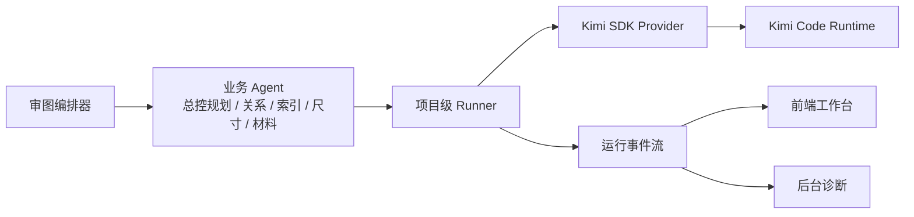

# 基于 kimi-agent-sdk 的审图 Runner 接入设计

**背景**

当前审图系统已经有一套项目级 Runner 思路，也已经开始把 AI 调用往统一入口收。

现在要定的是下一步底层到底怎么接：

- 继续走传统 HTTP API
- 直接把 `kimi-cli` 当主实现
- 还是基于 `kimi-agent-sdk` 来做正式接入

这件事之所以重要，不只是技术选型问题，还直接关系到：

- 本地测试成本高不高
- 流式过程稳不稳
- 结果坏掉时能不能自动补救
- 后面能不能做成更像 CodePilot 的 GUI 工作台

---

## 先说结论

**主实现建议基于 `kimi-agent-sdk`。**

`kimi-cli` 很值得参考，但更适合拿来借经验，不适合直接当我们业务系统的主底层。

一句大白话总结就是：

- `kimi-agent-sdk` 更像“可以拼进我们系统里的干净零件”
- `kimi-cli` 更像“已经做好的整机”

所以更稳的路线是：

- **主开发：基于 `kimi-agent-sdk`**
- **实现经验：参考 `kimi-cli`**

---

## 最关键的问题：SDK 能不能吃到 Kimi Code 订阅

### 结论

**理论上可以，而且方向是对的。**

原因不是猜的，是从官方项目结构里能直接看出来：

### 证据 1：`kimi-agent-sdk` 控制的是 Kimi Code 运行时，不是传统纯 API 封装

在 [python/README.md](/tmp/kimi-agent-sdk/python/README.md) 里，官方写得很直接：

- 它是 “programmatically controlling the Kimi CLI (Kimi Code) agent runtime”

大白话就是：

- 这个 SDK 控制的是 **Kimi Code 运行时**
- 不是只会拿一个 `api_key` 去打按量 HTTP 接口

### 证据 2：Session API 本身就是会话式运行时，而不是单次请求包装

在 [guides/python/session.md](/tmp/kimi-agent-sdk/guides/python/session.md) 里，核心能力包括：

- `Session.create(...)`
- `Session.resume(...)`
- `Session.prompt(...)`
- `Session.cancel()`
- `Session.close()`

这说明它本来就是：

- 长会话
- 流式输出
- 可恢复
- 可取消

这和 `Kimi Code` 订阅/运行时是同一路。

### 证据 3：`kimi-cli` 本身就是通过 OAuth 登录到 Kimi Code 账户

在 [klips/klip-14-kimi-code-oauth-login.md](/tmp/kimi-cli/klips/klip-14-kimi-code-oauth-login.md) 里，官方明确写了：

- `kimi login`
- Kimi Code OAuth
- access token / refresh token
- 运行时动态注入 token

也就是说：

- `kimi-cli` 不是只能吃手工 API key
- 它本来就支持 **Kimi Code 登录态**

而 `kimi-agent-sdk` 又是控制 `Kimi Code runtime` 的 SDK，所以方向上是打通的。

---

## 但这里有一个边界要说清楚

**“理论上可以” 不等于 “我们现在已经在项目里直接拿 SDK 用上会员了”。**

当前更准确的判断是：

- `kimi-agent-sdk` 走的是 Kimi Code 运行时这条线
- `kimi-cli` 已经把 OAuth 登录这套路打通了
- 所以我们做 SDK 接入时，应该优先复用这条登录态 / 运行时能力

但要注意一点：

**我们不能把“会员订阅”理解成一个公开、稳定、像按量 API key 那样的单字段配置。**

更现实的做法应该是：

- 本地开发环境：
  - 复用本机已有的 Kimi Code 登录态
- 审图 Runner：
  - 通过 SDK 连到本地 Kimi Code runtime
- 线上或无登录态环境：
  - 保留 API provider 兜底

一句话：

**本地优先走 Kimi Code 订阅能力，线上继续保留 API 兜底。**

---

## 为什么不建议直接把 kimi-cli 当主实现

不是说它不好，而是它更像一整套现成产品。

它已经自带：

- shell UI
- ACP server
- 技能系统
- 工具系统
- 会话持久化
- Web UI

这些很强，但如果我们直接把它整个塞进审图系统，后面容易遇到两个问题：

### 1. 控制权不够稳

我们现在已经有自己的：

- 项目级 Runner
- 业务 Agent
- 证据规划
- Finding 结构
- 误报经验
- 预算

如果直接以 CLI 为主，后面会慢慢变成：

- 我们在适应 CLI 的行为
- 而不是 CLI 在适应我们的审图架构

### 2. 业务规则容易跑进 CLI prompt 里

这会导致：

- 逻辑越来越黑箱
- 很难查清到底是谁决定了某个结果
- 后面维护成本变高

所以更稳的路线是：

- **业务逻辑留在我们自己系统里**
- **底层 AI 运行时用 SDK 接**
- **CLI 作为参考实现**

---

## 为什么推荐主实现基于 kimi-agent-sdk

### 1. 更适合塞进我们现在的 Runner 架构

我们现在最需要的是一个可控的 Provider：

- 能开会话
- 能续会话
- 能流式吐内容
- 能取消
- 能拿到结构化事件

SDK 比 CLI 更适合做这种“嵌入式零件”。

### 2. 更容易做结果守门

你前面一直在强调一个痛点：

- JSON 格式不对
- 输出半截
- 整轮审核就炸

如果走 SDK，我们更容易自己掌控：

- 什么时候让它重说
- 什么时候做格式修复
- 什么时候转 `needs_review`

### 3. 更适合做项目级子会话池

我们之前已经定过一个关键规则：

- 一个项目一个 Runner
- 但不同业务 Agent 要有独立子会话

这和 SDK 的 Session 模型很搭。

### 4. 更容易做长期维护

从长期看：

- SDK 更稳定
- 边界更干净
- 更适合测试
- 更适合以后继续扩 GUI

---

## 并发模型怎么和 SDK 对上

这里有一个必须写死的点。

在 [guides/python/session.md](/tmp/kimi-agent-sdk/guides/python/session.md) 里，官方写得很清楚：

- **Single active turn**
- 同一个 session 里，不能并发开多个 prompt

所以我们的 Runner 不能这样设计：

- 一个项目只拿一个 SDK session
- 然后让关系 / 尺寸 / 材料一起往里塞

这样会直接冲突。

### 正确做法

还是沿用我们已经定好的结构：

- **一个项目一个 Runner**
- **Runner 维护子会话池**
- **每个业务 Agent 用独立子会话**

共享的是：

- 目录
- 项目版本
- 技能包
- 误报经验
- 项目级上下文

独立的是：

- 每个 Agent 的会话历史
- 重试次数
- 当前 turn 状态

一句大白话：

**项目是一套总上下文，但关系/尺寸/材料不能共用同一根“电话线”。**

---

## 推荐架构

其中：

- `Runner` 继续是项目级公共层
- `Kimi SDK Provider` 是新的底层实现
- `Kimi Code Runtime` 负责真正执行会话和流式输出

---

## Kimi CLI 对我们的真正价值

虽然主实现不建议直接基于 CLI，但 `kimi-cli` 仍然很有价值。

最值得借的 4 个点：

### 1. 会话持久化方式

在 [session.py](/tmp/kimi-cli/src/kimi_cli/session.py) 里，它已经有：

- session create
- session find
- session continue
- 状态文件
- wire 日志

这些都很适合给我们的 Runner 做参考。

### 2. 事件模型

在 [acp/session.py](/tmp/kimi-cli/src/kimi_cli/acp/session.py) 里，它已经区分了：

- 思考流
- 正文流
- 工具调用
- 工具结果
- 审批请求

这正好能指导我们整理自己的 Runner 事件。

### 3. 取消机制

CLI 已经有：

- 运行中的 turn cancel

这对我们修“卡住停不掉”问题非常有参考意义。

### 4. GUI / ACP 接入方式

以后你想把前端慢慢做成类似 CodePilot 的 GUI 工作台，这部分很值得继续借。

---

## 推荐落地路线

### 阶段 1：先做 `KimiSdkProvider`

目标：

- 不改业务架构
- 只把 Runner 底层 Provider 接成 SDK

包括：

- 建立 `KimiSdkProvider`
- 打通 `Session.create / resume / prompt / cancel / close`
- 先接总控规划和尺寸审查

### 阶段 2：让关系 / 索引 / 材料逐步迁过去

目标：

- 所有 AI 调用统一走 Runner + SDK Provider

### 阶段 3：再决定是否保留 CLI 特殊模式

这一步才讨论：

- 本地会员模式是否还需要一个 CLI-only provider
- 或者 SDK 已经能完整覆盖，就不必单独维护 CLI provider

---

## 不做什么

这一步也要定清楚，避免后面越做越散。

### 1. 不直接把 `kimi-cli` 整坨嵌进项目

我们借它的经验，不直接把它当主框架。

### 2. 不把业务判断下放给 SDK 或 CLI

SDK / CLI 负责 AI 运行时。

业务上的：

- 审图规则
- 证据规划
- 预算
- 误报经验

仍然由我们自己的系统控制。

### 3. 不把“会员订阅”写死成唯一依赖

本地优先用它，线上仍保留 API 兜底。

---

## 验收信号

做到下面这些，才算这条路线成立：

1. 本地开发机在已有 `Kimi Code` 登录态下，可以不填传统 API key 直接跑通一次 Runner 调用。
2. `KimiSdkProvider` 能稳定拿到：
   - 流式正文
   - 思考片段
   - 取消信号
   - 会话恢复
3. 同一项目下，关系 / 尺寸 / 材料能并发跑，但各自使用独立子会话，不会互相冲掉。
4. 业务 Agent 代码里不再直接调 `call_kimi()` / `call_kimi_stream()`。
5. 输出格式坏掉时，Runner 还能先做补救，而不是直接把整轮审图打死。
6. 本地测试默认走 SDK 路径，成本明显低于继续走按量 API。

---

## 最终建议

**建议立刻把方向定成：主实现基于 `kimi-agent-sdk`，`kimi-cli` 作为参考实现。**

大白话就是：

- 真正接代码，用 SDK
- 真正借经验，看 CLI

这样既能保住我们自己的业务控制权，也更有机会把你本地已经有的 `Kimi Code` 订阅能力利用起来。
