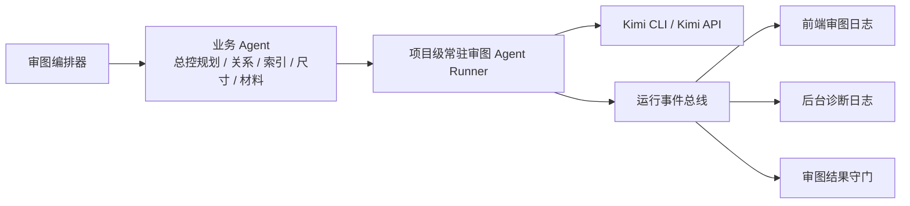

# 项目级常驻审图 Agent Runner 设计

**背景**

当前审图系统已经有：

- 总控规划Agent
- 关系审查Agent / 索引审查Agent / 尺寸审查Agent / 材料审查Agent
- 证据规划器
- 证据服务层
- 运行事件流
- 真流式接入

但现在还有一个明显短板：

- AI 还是在“按次调用”
- 输出格式一旦不稳，容易直接把业务流程拖死
- 流式内容虽然已经能看到，但更像“底层原始信号”，还不是一个真正可管理的常驻 AI 中间层

用户希望参考 OpenClaw 的思路，不只是继续直连 API，而是在整个审图运行链中间引入一个**常驻的 AI 代理层**。这个代理层负责接住 AI 输出、维护会话、订阅过程事件、做格式修复和失败补救。

---

## 总体判断

**要借 OpenClaw 的，不是单纯“CLI 这个壳”，而是下面这套组织方式：**

- 常驻会话
- 事件订阅
- 工具代理
- 输出守门
- 会话级重试与修复

所以，这里真正应该新增的，不是“某个具体业务 Agent”，而是一个放在整条审图事件链中间的：

**项目级常驻审图 Agent Runner**

它既不是总控规划Agent，也不是关系/尺寸/材料里的某一个。

它的定位更像：

- AI 通信总入口
- 结果守门员
- 流式事件中枢
- 会话级修复器

---

## OpenClaw 给我们的真正启发

参考 OpenClaw 的设计后，最值得借的有 5 个点。

### 1. 会话是常驻的，不是每次临时起一个脑子

OpenClaw 的核心之一，是每个会话都有持续上下文。

映射到审图系统里，意思就是：

- 同一个项目的一整轮审图，应当尽量共用一条 AI 会话
- 前面已经整理过的上下文，不该每一步都重新塞一遍
- 前面已经失败过的格式、已经做过的修复，也应该被会话记住

这能减少“每一步都像第一次见面”带来的不稳定。

### 2. 过程事件是一等公民，不只是最终结果

OpenClaw 不是只关心最后一句回复，而是持续订阅过程事件。

审图系统也应该一样：

- AI 开始回答
- AI 正在持续输出
- AI 长时间没有新增
- AI 正在自动重试
- AI 输出格式校验失败
- AI 正在被要求重新按结构输出

这些都应该成为正式运行事件，不应该只藏在调试日志里。

### 3. 工具层和模型层要分开

OpenClaw 里，Agent 不是直接裸调用模型，而是通过工具完成动作。

放到审图系统里，也应该这样理解：

- 业务 Agent 负责“我要查什么”
- 常驻 Runner 负责“怎么跟 AI 交互”

也就是说，业务 Agent 不再直接承担：

- 重试
- 修 JSON
- 流式拼装
- 输出守门

这些统一交给 Runner。

### 4. 失败处理应该是会话级的，不只是请求级的

OpenClaw 的思路不是“一次失败就整轮结束”，而是：

- 尽量修
- 尽量重试
- 尽量降级
- 最后才判失败

这正好对应我们现在的痛点：

- 一次 JSON 不完整
- 一次流式半截
- 一次输出格式脏了

不应该直接把整轮审图打死。

### 5. 流式不是附属 UI，而是运行时能力

OpenClaw 把流式过程当成核心运行能力，不只是给人看个热闹。

对审图系统也是一样：

- 前端要看
- 后端要用它来判断状态
- Runner 要用它来决定是否重试、是否补问、是否判失败

---

## 方案比较

### 方案 A：继续在每个业务 Agent 里局部加补丁

做法：

- 总控规划Agent 自己做重试
- 尺寸审查Agent 自己修 JSON
- 材料审查Agent 自己判断是否补问

优点：

- 改动小
- 复用现有结构最多

缺点：

- 逻辑会越来越散
- 每个 Agent 都要重复写一套“和 AI 打交道”的代码
- 以后换 CLI / API / 新引擎时成本高

**结论：不推荐。**

### 方案 B：引入项目级常驻审图 Agent Runner

做法：

- 审图编排器和业务 Agent 继续存在
- 新增一个项目级常驻 Runner
- 所有 AI 调用都先经过 Runner
- Runner 负责：
  - 会话
  - 流式事件
  - 输出格式修复
  - 自我重试
  - 最终结构校验
- Runner 底层可以对接：
  - Kimi CLI
  - Kimi API

优点：

- 最符合 OpenClaw 的核心思路
- 可以逐步替换底层引擎，而不改上层业务 Agent
- 能把“输出不稳”这类问题收口到同一层

缺点：

- 比 A 复杂
- 需要新增一层运行时抽象

**结论：推荐。**

### 方案 C：直接把 Kimi CLI 当主引擎，把业务逻辑大量下放给 CLI 会话

做法：

- 让 CLI 承担更多业务决策
- 后端主要做转发和状态记录

优点：

- 流式体验通常更自然
- 本地调试更直观

缺点：

- 太黑箱
- 业务规则容易逐步跑进 CLI prompt 里
- 将来线上部署和并发控制难度高

**结论：不建议第一阶段直接这样做。**

---

## 推荐方案

采用 **方案 B：项目级常驻审图 Agent Runner**。

一句大白话总结就是：

**不是让 CLI 直接取代后端逻辑，而是让 Runner 成为整个审图过程和底层 AI 之间的中间层。**

Runner 下面可以接 CLI，也可以接 API。

这样我们借到的是 OpenClaw 的“会管事的常驻代理层”，而不是只借到一个命令行入口。

这里要特别说明一件事：

- **Runner 的架构位置，从第一天起就是项目级公共层**
- 它不是先做成“总控规划Agent专属”或“尺寸审查Agent专属”
- 后面文档里提到的“先接总控规划Agent和尺寸审查Agent”，说的是：
  - **第一阶段先让这两个业务调用方接入这个公共层**
  - 而不是说 Runner 本身只属于这两个 Agent

大白话讲：

- 楼里的总电箱是一开始就给整栋楼准备的
- 只是第一次送电时，先挑两路回路试跑
- 不是说这个总电箱只服务那两路

---

## 新架构



---

## Runner 的职责

### 1. 维护项目级会话

同一个项目的一整轮审图，应尽量使用同一条长会话。

Runner 需要记住：

- 当前项目
- 当前审核版本
- 当前正在处理哪个业务 Agent
- 之前已经做过哪些补问
- 之前哪些输出格式失败过
- 当前已经用了多少重试次数

### 1.1 并发策略

这里必须明确，不然实现时很容易走偏。

当前审图系统里：

- 关系审查Agent
- 尺寸审查Agent
- 材料审查Agent

这些业务调用方本来就可能并行执行。

所以，Runner **不能**简单理解成“整个项目只有一条串行会话，所有 AI turn 排队轮流跑”。那样虽然安全，但会把整轮审图明显拖慢。

本设计采用下面这条并发策略：

- **同一个项目只有一个 Runner 实例**
- **但 Runner 内部维护一个子会话池**
- **不同业务 Agent 各自持有独立子会话，可以并发跑**

也就是说：

- `总控规划Agent` 用自己的子会话
- `关系审查Agent` 用自己的子会话
- `尺寸审查Agent` 用自己的子会话
- `材料审查Agent` 用自己的子会话

这些子会话都挂在同一个项目级 Runner 下面。

它们共享的是：

- 项目级上下文
- 目录与图纸摘要
- 当前审核版本
- 已知误报经验
- 技能包和全局调度信息

它们各自独立维护的是：

- 输出历史
- 重试计数
- 最近一次结构修复记录
- 当前这条任务的流式状态

一句大白话就是：

- 整个项目共用一个“总管”
- 但每个业务 Agent 都有自己的一条“小会话”
- 大家共享项目背景，不共享彼此的临时输出尾巴

### 1.2 不采用什么并发模型

这一版**不采用**下面这个模型：

- 一个项目一个 Runner
- 整个项目内只有一条串行长会话
- 所有业务 Agent 的 turn 全部排队

原因很简单：

- 太慢
- 会把并行审查能力打掉
- 不适合关系 / 尺寸 / 材料并发跑的当前主链

### 2. 统一接管 AI 调用

业务 Agent 不直接调用：

- `call_kimi()`
- `call_kimi_stream()`

而是改成把任务交给 Runner，例如：

- `run_planning_turn(...)`
- `run_relationship_turn(...)`
- `run_dimension_turn(...)`

底层是 CLI 还是 API，由 Runner 决定。

### 3. 统一接管流式过程

Runner 需要统一产出三类事件：

1. **业务阶段事件**
   - 开始关系分析
   - 开始尺寸核对
   - 完成材料核对

2. **AI 过程事件**
   - 开始请求 AI
   - AI 正在流式输出
   - AI 长时间没新内容
   - AI 正在第 2 次自动重试

3. **结构守门事件**
   - 输出结构校验通过
   - 输出结构不完整
   - 已自动发起补问
   - 已降级为 `needs_review`

### 4. 做“结果守门”

这是这个设计里最关键的一条。

业务主流程不应该再直接吃底层模型的原始输出。

Runner 在把结果交给业务链路前，至少要做：

- 是否是合法结构
- 必填字段是否齐全
- JSON 是否完整
- 是否符合当前任务的结构约束

如果不符合，不直接放行。

### 5. 做“自我修复”

当输出不稳时，Runner 应先尝试局部补救：

- 去掉代码块包裹
- 补齐明显的尾部截断
- 重新请求“请只按指定结构输出”
- 重试当前这一个 turn

仍不行时，再把这条任务降成：

- `needs_review`

而不是直接整轮失败。

---

## Runner 和业务 Agent 的边界

这个边界必须写死，不然系统会再次变脏。

### 业务 Agent 负责

- 要查什么
- 这条任务的业务目标是什么
- 需要哪些证据
- 最终问题如何进入报告

### Runner 负责

- 怎么和 AI 说话
- 怎么维持会话
- 怎么读流
- 怎么重试
- 怎么修格式
- 怎么产出事件

### 不做什么

- Runner 不负责替代证据规划器
- Runner 不负责替代业务判定规则
- Runner 不负责直接决定所有问题结论
- Runner 不把业务规则偷偷塞回 CLI prompt 里长期漂移

---

## CLI 和 API 的关系

这里的关键不是“二选一”，而是 Runner 下面做成可插拔 Provider。

建议：

- `provider = cli`
- `provider = api`

### CLI 的价值

- 更像对话式流
- 调试时更直观
- 更适合承载常驻会话

### API 的价值

- 更适合线上和服务化
- 更适合并发控制
- 更适合标准化部署

### 推荐策略

第一阶段先做：

- 本地开发环境：优先 `cli`
- 服务端 / 兼容路径：保留 `api`

这样不会把整个系统一次性绑死在 CLI 上。

---

## 事件设计

Runner 应该新增一组比现在更明确的运行事件。

建议至少包括：

- `runner_session_started`
- `runner_turn_started`
- `provider_stream_delta`
- `provider_idle`
- `provider_retrying`
- `output_validation_failed`
- `output_repair_started`
- `output_repair_succeeded`
- `output_repair_failed`
- `runner_turn_completed`
- `runner_turn_needs_review`
- `runner_session_completed`
- `runner_session_failed`

### 事件命名和现有事件的关系

这里也要明确，不然很容易跟现有流式设计文档打架。

当前系统已经有：

- `model_stream_delta`
- `phase_event`

Runner 接入后，命名策略调整为：

- **`provider_stream_delta` 替代现有 `model_stream_delta`**
- **`phase_event` 保留，继续由业务 Agent 产出**

也就是说：

- `provider_stream_delta`
  - 表示底层 AI Provider 的真实流式片段
  - 这是 Runner 负责产出的事件
- `phase_event`
  - 表示业务阶段事件
  - 这是业务 Agent 继续负责产出的事件

所以它们不是并存两套“差不多意思”的名字，而是：

- `provider_stream_delta` = 新名字
- `model_stream_delta` = 旧名字，接入 Runner 后作废
- `phase_event` = 继续保留，不替代

其中：

- 普通用户默认只看“业务阶段事件 + 结果守门事件”
- 调试视图再看“provider_stream_delta”

---

## 最小落地版本

第一版不要一口气让所有业务 Agent 都接入 Runner。

这里再次强调：

- `Runner` 自身从一开始就是项目级公共运行层
- 只是为了降低风险，**接入 Runner 的业务调用方**需要分阶段迁移
- 也就是说，变化的是“谁先接入它”，不是“它归谁所有”

建议先试点两条最有价值的链路：

1. **先让总控规划Agent 接入 Runner**
   - 因为它是整轮审图的入口
   - 最适合先验证常驻会话和事件流

2. **再让尺寸审查Agent 接入 Runner**
   - 因为它最容易受 JSON 结构不稳影响
   - 最适合先验证“输出守门 + 自动补问”

等这两条跑稳，再逐步让其他业务调用方接入同一个 Runner：

- 关系审查Agent
- 索引审查Agent
- 材料审查Agent

---

## 验收信号

如果这个设计做对了，应该能看到这些现象：

1. 同一项目的一整轮审核，有清晰的 Runner 会话编号和过程事件。
2. 遇到 JSON 不完整时，不再立刻整轮失败，而是先出现：
   - 结构校验失败
   - 自动补问
   - 自动重试
3. 普通用户看到的是“AI 正在处理什么”，而不是原始 JSON 碎片。
4. 调试时仍能看到底层真实流式过程。
5. 本地可以切换到 CLI provider，服务端仍可保留 API provider。
6. 单次模型输出结构不稳时，更多任务会落为 `needs_review`，而不是整轮崩掉。
7. 业务 Agent 代码里不再直接调用 `call_kimi()` 或 `call_kimi_stream()`，所有 AI 调用路径都经过 Runner。

第 7 条可以直接机器验证，例如：

```bash
rg -n "call_kimi\\(|call_kimi_stream\\(" /Users/harry/@dev/ccad/cad-review-backend/services/audit
```

验收目标是：

- 业务 Agent 目录下不再出现新的直接调用
- AI 调用统一收口到 Runner / Provider 层

---

## 下一步

如果这份设计方向确认，下一步建议直接写实施计划，按下面顺序推进：

1. 定义 `AgentRunner` 抽象
2. 定义 `Provider` 抽象（CLI / API）
3. 接入项目级会话和运行事件
4. 在总控规划Agent试点
5. 在尺寸审查Agent试点
6. 再扩到其他业务 Agent
