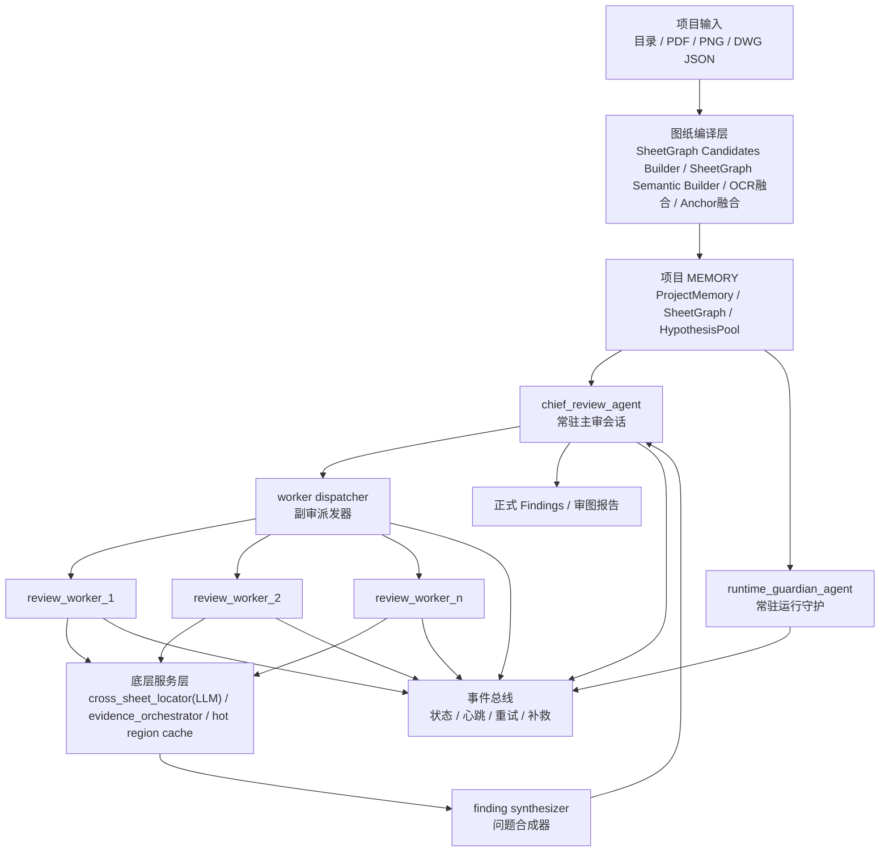

# 主审 + 副审群审图架构重构设计

**使用的 skills**

- `brainstorming`
- `architecture-designer`
- `openclaw-guide`

## 任务边界

这份文档只做两件事：

- 定义新的审图架构目标态
- 给后续全量重构提供清晰边界

这份文档不做三件事：

- 不直接改代码
- 不给旧架构打补丁
- 不把 JSON / 规则引擎重新抬回主判断位

## 为什么必须做大手术

当前系统的根问题不是某个 Agent 提示词写得不够好，而是骨架错了。

现状的主路径是：

- 先把任务切成 `index / dimension / material`
- 再按任务类型派给不同 Agent
- 再由证据规划器给它们固定证据包

这会天然把系统推向“数据比对型审图”：

- 主审不像人工主审，更像调度器
- 关系审查不像跨图导航能力，更像专项 checker
- 尺寸 / 材料过早成为一级任务类型，打断了自然的审图理解
- LLM 被压缩成“填 JSON 的执行器”，而不是“真正看图的人”

用户已经明确确认，这条路越走越别扭，应该整体重构。

## 最高原则

### 原则 1：LLM 是审图员，代码和 JSON 只是扶手

- 问题先由 LLM 通过图纸理解提出
- JSON 负责候选锚点、去模糊、提速、交叉验证
- 代码负责会话、缓存、调度、恢复、结构校验
- 代码和 JSON 都不能替代“这条问题是否成立”的判断

### 原则 1.5：凡是跨图理解，默认交给 LLM

- 图纸分类最终判断交给 LLM
- 节点归属最终判断交给 LLM
- 跨图对应最终判断交给 LLM
- 代码只能缩小候选范围，不能先裁决“是不是同一个位置”

### 原则 2：Prompt 退居组装层

系统不再以 `PROMPT.md` 为中心。

以后真正的知识入口是：

- `AGENTS.md`：硬边界、工具权限、输出合同
- `SOUL.md`：角色思维、判断习惯、审图气质
- `MEMORY.md`：项目现场记忆、已确认关系、怀疑池、误报经验

`PROMPT` 只负责把上面三类内容和当前任务上下文拼起来。

### 原则 3：主审负责脑子，副审负责手脚

- 主审负责理解整套图、生成怀疑、收敛结果
- 副审负责在小范围内快速核查
- 副审不是另一个老板，只能提交结构化答卷，不能直接下最终结论

### 原则 4：导航是基础设施，不是一级终审角色

“关系审查 Agent”不再保留为一级业务 Agent。

它要拆成：

- 预计算图纸关系图
- 跨图定位服务
- 罕见歧义时的特种副审能力

### 原则 5：速度优先靠并行和预计算，不靠削弱理解

系统提速的方法不是让 LLM 少想，而是：

- 让重复定位前置
- 让局部核查并行
- 让证据复用
- 让主审只盯高价值问题

## 方案比较

### 方案 A：单主审大一统

做法：

- 整轮只保留一个主审 Agent
- 所有判断、定位、回跳都在一个会话里完成

优点：

- 架构简单
- 最能保留自然推理

缺点：

- 速度慢
- 上下文膨胀快
- 复杂项目容易卡在单线程脑回路里

**结论：不选。**

### 方案 B：主审 + 导航双常驻 Agent

做法：

- 主审负责问题理解
- 导航负责跨图定位
- 两者持续对话推进

优点：

- 比当前系统更像人工审图
- 角色边界比旧架构清晰

缺点：

- 仍然偏串行
- 主审和导航之间会产生大量“问一句回一句”的等待
- 速度起不来

**结论：不选。**

### 方案 C：主审 + 副审群 + 底层服务

做法：

- 一个常驻主审
- 一个常驻运行守护者
- 一组按需生成的副审
- 导航、定位、预取、缓存全部下沉为基础服务

优点：

- 最大化利用 LLM 理解能力
- 同时保留并行速度
- 最适合 Kimi SDK 的多子会话能力
- 最符合 OpenClaw 的 session-first / tool-first 思路

缺点：

- 架构改动最大
- 迁移期会更复杂
- 对 MEMORY 和事件流设计要求更高

**结论：推荐，作为本次重构目标态。**

## 新架构总览



## 一级角色定义

### 1. `chief_review_agent`

这是新的核心，不再叫“总控规划 Agent”。

职责：

- 阅读目录和整套图纸编译结果
- 建立整轮审图理解
- 生成一批 `HypothesisCard`
- 判断要不要派副审，派多少副审
- 合并副审答卷
- 对低置信度结果做二次复核
- 产出最终 Findings

不负责：

- 逐条手工定位
- 重复搬运证据
- 自己承担所有局部核对

### 2. `review_worker_pool`

这是副审群，不是固定 3 个老业务 Agent。

副审的本质是“按需生成的 LLM 助手”，每个副审只拿一个很小的任务卡。

推荐 worker 类型：

- 空间一致性副审
- 标高一致性副审
- 节点归属副审
- 节点母图绑定副审
- 材料语义一致性副审
- 索引引用副审
- 特种歧义定位副审

硬约束：

- 副审只能挂在主审下面
- 副审默认不能再生成孙 Agent
- 副审不下最终结论
- 副审只返回结构化结果卡

### 3. `runtime_guardian_agent`

职责不变，但位置更重要。

它负责：

- 监控 chief / worker 会话健康
- 识别死循环、假活、频繁失败
- 判断是否需要重启 chief 或丢弃某批 worker
- 用人话播报运行状态

不负责：

- 业务审图判断
- 证据定位
- 结果裁决

## 基础服务定义

### 1. `sheet_graph_candidates_builder`

一次性完成：

- 目录、OCR、JSON、已有边关系的候选整理
- 候选图纸分类线索整理
- 候选跨图关系整理
- 候选节点母图线索整理

它不做最终语义裁决，只负责把搜索空间缩小。

### 2. `sheet_graph_semantic_builder`

一次性完成：

- 基于候选上下文做图纸语义建图
- 图纸层级关系初建
- 平面 / 天花 / 地坪 / 立面 / 节点 / 家具节点最终判断
- 候选跨图关系的语义确认

输出：

- `SheetGraph`
- `SheetSemanticSummary`

### 3. `cross_sheet_locator`

职责：

- 给定一个区域或对象，查它在别的图上的对应区域
- 给节点图找母图位置
- 给立面标高找平面/天花对应位置

它是 `LLM-first` 的跨图定位 worker / 服务，不是代码优先的查表器。

它的工作方式必须是：

- 代码先给出有限候选图、候选区域、OCR / JSON 锚点
- `cross_sheet_locator` 用 LLM 判断哪个候选真的是同一位置
- 找不到时返回“不确定”，而不是让代码先拍板

所以这里的代码只负责“缩小搜索范围”，不负责“决定对应关系”。

### 4. `evidence_orchestrator`

职责：

- 批量取图
- 批量裁图
- 热区预取
- 同区域跨任务复用
- 控制视觉预算

它面向主审和副审统一服务。

注意：

- `evidence_orchestrator` 不做业务判断
- 它不决定哪一块真的是对应区域
- 它只服务已经被 LLM 选中的候选区域

### 5. `finding_synthesizer`

职责：

- 把多个副审结果卡合成为正式 Findings
- 标记 `confirmed / suspected / needs_review`
- 记录每条 Finding 来自哪些 worker、哪些证据、哪些回跳轮次
- 同一 `hypothesis_id` 下如果收到冲突结论，`finding_synthesizer` 不裁决，自动把相关结果标记为 `escalate_to_chief=true`，交回主审做最终判断

## AGENTS / SOUL / MEMORY 组织方式

## 目录结构

```text
cad-review-backend/
  agents/
    chief_review/
      AGENTS.md
      SOUL.md
      MEMORY.md
    runtime_guardian/
      AGENTS.md
      SOUL.md
      MEMORY.md
    review_worker/
      AGENTS.md
      SOUL.md
      MEMORY.md
```

## 用法约定

### `AGENTS.md`

写死这些内容：

- 角色职责
- 能调用哪些工具
- 不能做什么
- 输出必须长什么样
- 什么情况下必须回跳
- 什么情况下必须交回主审

### `SOUL.md`

写角色的“工作气质”：

- 主审要像带项目的审图负责人
- 副审要像聚焦的专项复核员
- 守护者要像值班长

### `MEMORY.md`

分三层：

- 静态角色记忆
- 项目运行记忆
- 误报经验记忆

其中项目运行记忆至少包含：

- 当前图纸分类结果
- 已确认的跨图关系
- 怀疑池
- 已完成副审任务摘要
- 已被证明无效的回跳路径

## 数据模型重构

旧模型的问题是过早把任务切成 `index / dimension / material`。

新模型改成下面几类对象：

### `ProjectMemory`

```python
class ProjectMemory(BaseModel):
    project_id: str
    audit_version: int
    sheet_graph_version: str
    sheet_summaries: list[dict]
    confirmed_links: list[dict]
    active_hypotheses: list[dict]
    resolved_hypotheses: list[dict]
    false_positive_hints: list[dict]
```

### `HypothesisCard`

```python
class HypothesisCard(BaseModel):
    id: str
    topic: str
    source_context: str
    suspicion: str
    target_sheet_candidates: list[str]
    priority: int
    risk_level: str
    suggested_worker_kind: str
```

### `WorkerTaskCard`

```python
class WorkerTaskCard(BaseModel):
    id: str
    hypothesis_id: str
    worker_kind: str
    objective: str
    source_sheet_no: str
    target_sheet_nos: list[str]
    anchor_hints: list[dict]
    evidence_budget: dict
```

### `WorkerResultCard`

```python
class WorkerResultCard(BaseModel):
    task_id: str
    status: str
    judgement: str
    confidence: float
    evidence_refs: list[dict]
    anchor_pairs: list[dict]
    notes: str
    escalate_to_chief: bool
```

### `Finding`

保留结构化输出，但只用于最终提交，不干扰 LLM 内部思考。

## 新运行流程

### 阶段 1：图纸编译

- 读取目录、PDF、PNG、DWG JSON
- 先建立候选图谱，再由 LLM 建立 `SheetGraph`
- 生成项目初始 `MEMORY`

### 阶段 2：主审首轮理解

- 主审读目录和 `SheetGraph`
- 决定阅读入口
- 生成首批 `HypothesisCard`

### 阶段 3：副审并行核查

- 主审按批次派副审
- 副审调用 `cross_sheet_locator` 和证据服务
- 副审提交 `WorkerResultCard`

### 阶段 4：主审收敛

- 主审合并副审结果
- 对冲突结果做二次判断
- 必要时生成第二轮副审任务

### 阶段 5：正式提交

- `finding_synthesizer` 生成 Findings
- 结果写回 MEMORY
- 前端展示

## 提速设计

这是本次重构的关键。

### 1. 先编译，后审图

把最耗时间的“候选整理、图纸语义建图、热区预取”前置。

### 2. 主审批量生成怀疑点

主审一次不是只吐一个问题，而是吐一批 `HypothesisCard`。

### 3. 副审池并行

主审按批派发副审，批量收答卷。

### 4. 证据按区域复用

- 同一区域只渲染一次
- 同一裁图被多个 worker 复用
- 热区进入缓存

### 5. 跨图定位仍然走 LLM，但必须被 runtime 限界

- 一次最多看有限候选图
- 一次最多看有限候选区域
- 优先看预裁好的局部证据
- 低置信度才升级下一轮证据

### 6. 动态副审数量

主审可根据复杂度决定生成多少副审，但受运行时约束：

- 并发上限
- 视觉预算上限
- 相同类型 worker 数量上限

### 7. 只把低置信度结果送回主审深想

高置信度局部结果直接进入合成器候选池，减少主审负担。

## OpenClaw 思路在这里如何落地

本次真正借的是 5 个东西：

- 常驻 session
- 工具路由
- 记忆文件
- 事件订阅
- 会话级补救

对应到本项目：

- `chief_review_agent` 和 `runtime_guardian_agent` 都是常驻 session
- `review_worker_pool` 使用 Kimi SDK 子会话按需生成
- `cross_sheet_locator` 也走受限的 LLM worker 会话，而不是规则查表
- `AGENTS / SOUL / MEMORY` 成为主资源
- 事件总线继续保留并扩展
- 失败恢复从“请求级重试”升级到“会话级恢复”

## 迁移策略

### 第 1 阶段：搭底座，不切流量

- 引入新的 agent 资源目录
- 引入 `SheetGraph` 和 `ProjectMemory`
- 不切主流程

### 第 2 阶段：接入主审和副审池

- 先让新 chief + worker 跑影子模式
- 只比对结果，不直接出正式报告

### 第 3 阶段：切一条真业务流

优先切：

- 节点归属
- 标高一致性

这两块最能体现“LLM 理解优先”的价值。

### 第 4 阶段：替换旧一级业务 Agent

- 弃用旧 `relationship_review_agent`
- 旧 `dimension / material` 降级成 worker 模板或兼容包装层

### 第 5 阶段：删除 prompt-first 旧路径

- 缩减 `PROMPT_STAGE_DEFINITIONS`
- 收口旧任务规划逻辑

## 风险与应对

### 风险 1：重构期速度反而先变慢

应对：

- 先做影子模式
- 先做缓存和定位服务
- 再上副审并行

### 风险 2：MEMORY 膨胀

应对：

- 分层记忆
- 定期 compact
- 副审只写摘要，不写整段推理

### 风险 3：副审无限扩张

应对：

- 运行时强制并发上限
- 禁止副审生成孙 Agent
- 统一由 chief dispatcher 分配

### 风险 4：旧前端只认识老 agent_key

应对：

- 中间期保留兼容事件映射
- 前端先支持新老并行展示

## 最终判断

这次重构不是把旧 Agent 名字改一改，而是把整套系统的世界观换掉：

- 从任务类型驱动，改成怀疑驱动
- 从 prompt-first，改成 AGENTS / SOUL / MEMORY first
- 从多业务 Agent 串行对话，改成主审 + 副审群 + 基础服务
- 从 JSON 主导，改成 LLM 主导，JSON 托底

这是重构成本最高的一条路，但也是最接近用户目标、最不容易越用越别扭的一条路。
