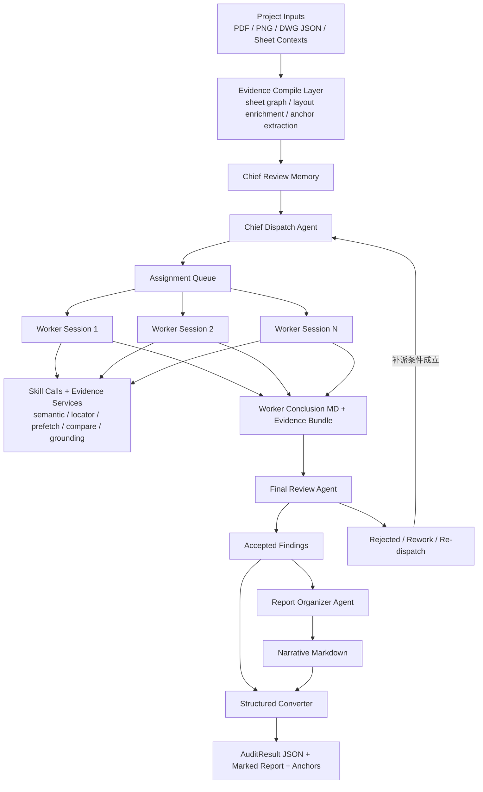

# 主审派单 + 副审执行 + 终审复核架构重构设计

**使用的 skills**

- `brainstorming`
- `architecture-designer`

## 1. 文档目的

这份文档定义审图系统下一阶段的正式目标架构，用来替换当前 `chief_review + worker swarm` 的错误分层实现。

这次重构不是补丁式修复，而是重新定义以下 5 个关键问题：

- 主审到底派什么任务
- 副审到底是什么对象
- 副审内部 skill 调用和前台可见卡片是什么关系
- 最终问题是怎么被确认、整理、结构化的
- 坐标、锚点、圈云证据如何全链路保真

## 2. 现状问题

当前系统已经完成了 `chief_review` 主路径替换，但运行模型仍然不符合真实产品心智。

主要问题有 4 个：

1. 主审派单粒度不对。
   当前主审生成的是偏泛的 hypothesis，例如一张任务里同时包含 `A1.06 -> A2.00, A2.01, A2.02` 这种多目标复核，导致副审执行空间过大，结果容易空泛。

2. 前台对象层级错了。
   当前前台展示的是底层运行时 session，而不是主审派出的副审任务本身，所以会出现“主审派了 14 个任务，但页面上有 64 个副审”的错觉。这对实现说得通，对用户完全不成立。

3. 终审角色缺失。
   现在副审结果经过规则化合成后直接进入 findings。系统缺少一个独立的终审角色来判断“副审结论是否成立、证据是否足够、是否需要补证据或驳回”。

4. 证据链在主链中丢失。
   DWG / layout JSON、anchor、global_pct、marked report 能力没有彻底消失，但在 `worker result -> finding -> audit_result` 这个链路里，精确定位证据没有完整透传，导致最终问题不稳定地丢坐标、丢圈云依据。

## 3. 设计目标

### 3.1 核心目标

- 建立与人工审图一致的运行心智模型：主审派单，副审查图，终审复核，整理汇总。
- 保证前台对象稳定：`1 个主审任务 = 1 个可见副审卡`。
- 让副审可以自由调用 skill，但这些 skill 不再膨胀成新的前台副审卡。
- 最终问题必须保留可落图的锚点和坐标证据。
- 最终报告先由 agent 产出自然语言 Markdown，再由代码结构化成 JSON。

### 3.2 非目标

- 不回退到旧的 `dimension / material / relationship` 阶段式主流水线。
- 不让 LLM 直接产最终数据库 JSON 作为唯一输出。
- 不把所有内部 runner 子步骤继续暴露给主 UI。

## 4. 硬约束

这次重构有两个不可妥协的约束。

### 约束 A：`1 个主审任务 = 1 个可见副审卡`

主审派了多少任务，前台最多就展示多少张副审卡。

副审内部可以：

- 调用多个 skill
- 多轮检索证据
- 进行局部单图语义提取
- 做跨图定位和 pair compare
- 进行重试和补证据

但这些都只能作为同一张副审卡内的动作流，不再升级成新的可见副审。

### 约束 B：任何最终问题都必须可定位

一个能进入最终结果的问题，必须至少具备以下信息之一，且优先使用高精度证据：

- `anchors[].highlight_region.bbox_pct`
- `anchors[].global_pct`
- `sheet_no`
- `evidence_pack_id`

如果问题只有语言描述、没有 grounding，则最多只能停留在“待终审”或“待补证据”，不能进入最终通过态。

## 5. 关键架构决策

## 决策 1：主审改成“逐张派单”，不再一次性批量派完

这是本次设计中最重要的新决策。

主审不再先一次性吐出整批大任务再整体分发，而是采用流式、逐张派单模型：

- 主审先建立整套图纸的全局理解
- 主审只生成当前最值得先查的一张 `ReviewAssignment`
- 一个副审开始执行后，主审根据最新证据继续决定下一张 assignment
- 整轮运行中，主审持续增量派单，而不是一口气把所有任务定死

这样做有 5 个好处：

1. 首个副审可以更早开工，降低首个结果延迟。
2. 主审可以依据已完成副审的结果，修正后续派单方向。
3. 可以避免一开始就派出大量冗余或过宽的任务。
4. 更符合人工主审行为，不需要假装一开始就知道全部问题。
5. 更适合后续引入“终审打回后主审补派新任务”的闭环。

这也意味着：

- `assigned_task_count` 不再是“启动时一次性确定的总数”
- 它会随着运行过程增长
- UI 上应该显示“已派出多少张任务卡”，而不是“总任务数已定”

## 决策 2：主审输出从 `HypothesisCard` 升级为 `ReviewAssignment`

当前的 hypothesis 更像“怀疑卡”，仍然太靠近内部推理，而不是执行合同。

新模型中，主审输出的是 `ReviewAssignment`，它是一张可直接交给副审执行的正式任务卡。

一张 assignment 只允许包含：

- 一个明确审查意图
- 一个主源图
- 一个很小的目标范围
- 一套明确的验收标准

推荐粒度：

- `A1.06 -> A2.00` 是一张 assignment
- `A1.06 -> A2.01` 是另一张 assignment
- `A1.06 -> A2.02` 再单独一张

不再允许把多个目标图粗暴打包进同一个副审任务里。

## 决策 3：副审是“单卡多技能执行 agent”

副审的前台身份是固定的 `ReviewWorkerSession`，不是底层 skill session。

副审内部允许调用：

- `sheet semantic`
- `cross sheet locator`
- `evidence prefetch`
- `pair compare`
- `material / index / node / elevation` 相关 skill
- grounding / anchor refinement

但这些都只是该副审的内部动作。前台只认这一张副审卡，不再把内部步骤拆成新卡。

## 决策 4：新增终审 agent

副审负责查图，终审负责裁决。

终审 agent 的职责只有 3 类：

- 判定副审结论是否成立
- 判定证据是否充分、是否可定位
- 给出处理建议：通过 / 驳回 / 打回补证据 / 要求主审补派新任务

终审不重新担任主审，也不负责最终汇总报告文案。

## 决策 5：新增整理汇总 agent

终审通过的问题，不直接让代码凭零散字段硬拼最终结果。

新增一个整理汇总 agent，专门做两件事：

- 把通过的问题整理成可读的 Markdown 问题条目
- 按严重性、图纸、主题、整改建议重组输出

这个 agent 的输出不是最终数据库 JSON，而是人读友好的 Markdown。

## 决策 6：最终 JSON 由代码从 `Markdown + EvidenceBundle` 生成

系统不再要求 agent 直接产最终结构化 JSON。

最终结果分成两部分：

- `narrative.md`
- `evidence_bundle.json`

最后由代码把这两部分合成：

- `AuditResult`
- 最终 API 返回 JSON
- marked report 所需的圈云锚点

这样可以把“自然语言表达”和“精确定位数据”分离，避免 LLM 在最终结构化层面破坏几何证据。

## 6. 新目标架构



## 7. 角色定义

### 7.1 主审派单 agent

职责：

- 阅读项目全局上下文
- 持续维护审图理解
- 增量生成 `ReviewAssignment`
- 判断何时继续派单、何时等待、何时停止
- 根据终审反馈补派新任务

初版停止条件必须显式定义，避免流式派单失控。建议 v1 固化以下终止判据：

- 当前没有活跃副审
- 待终审队列为空
- 主审连续两轮自检都未生成新的有效怀疑方向
- 全局图纸覆盖率达到最低阈值，或剩余未覆盖图纸被主审判定为低价值

初版补派条件也要显式定义。只有满足以下任一条件，主审才允许继续派新任务：

- 终审返回 `redispatch`
- 终审返回 `needs_more_evidence` 且指出新的证据方向
- 主审基于新完成副审结果识别出新的跨图关联

为了避免无限派单，建议增加两类硬限制：

- 单轮最大派单数
- 单个 assignment 最大补派次数

不负责：

- 直接完成局部证据核查
- 直接写最终问题条目
- 直接输出最终 JSON

### 7.2 副审执行 agent

职责：

- 接受单张 `ReviewAssignment`
- 选择并调用合适 skill
- 建立局部证据闭环
- 产出 `WorkerConclusion.md + EvidenceBundle`

不负责：

- 代替主审决定整体策略
- 直接让问题进入最终结果
- 绕过终审自行确认问题

### 7.3 终审复核 agent

职责：

- 对副审结论进行业务裁决
- 检查证据是否充分
- 检查锚点是否满足 marked report 要求
- 给出通过、驳回、补证据、补派单建议

### 7.4 整理汇总 agent

职责：

- 把终审通过的问题整理成最终报告的自然语言结构
- 输出 Markdown 版本的最终问题列表
- 做分组、归类、语义去重、建议整理

### 7.5 结构化转换器

这是最后一层代码，不是 agent。

职责：

- 读取整理后的 Markdown 和 evidence bundle
- 生成最终 `AuditResult` JSON
- 维持与数据库、API、marked report 的兼容

## 8. 数据契约

### 8.1 `ReviewAssignment`

```ts
type ReviewAssignment = {
  assignment_id: string
  review_intent: string
  source_sheet_no: string
  target_sheet_nos: string[] // 最多 2 张，超出时主审必须拆成多张 assignment
  scope_hint?: string
  task_title: string
  acceptance_criteria: string[]
  expected_evidence_types: string[]
  priority: number
  dispatch_reason: string
}
```

说明：

- 这是主审和副审之间的正式执行合同。
- 一张卡必须可以独立执行。
- 一张卡必须足够小，避免副审跑成泛泛而谈的“专项综述”。

### 8.2 `WorkerConclusion.md`

建议固定分段：

```md
## 任务结论
## 是否发现问题
## 证据说明
## 定位说明
## 建议动作
## 自评置信度
```

### 8.3 `EvidenceBundle`

```ts
type EvidenceBundle = {
  assignment_id: string
  evidence_pack_id: string
  anchors: Array<{
    sheet_no: string
    role?: "source" | "target" | "reference"
    global_pct?: { x: number; y: number }
    highlight_region?: {
      bbox_pct: { x: number; y: number; width: number; height: number }
    }
    label?: string
    grid?: string
    source_ref?: string
    target_ref?: string
  }>
  raw_skill_outputs: Record<string, unknown>[]
  grounding_status: "grounded" | "weak" | "missing"
}
```

约束：

- 如果 `grounding_status != grounded`，终审默认不能直接放行。

### 8.4 `FinalReviewDecision`

```ts
type FinalReviewDecision = {
  assignment_id: string
  decision: "accepted" | "rejected" | "needs_more_evidence" | "redispatch"
  rationale: string
  recommended_action?: string
}
```

### 8.5 `FinalIssue`

这是代码最终生成的统一问题对象，来源不是单一 LLM 输出，而是：

- `WorkerConclusion.md`
- `EvidenceBundle`
- `FinalReviewDecision`
- `Organizer Markdown Block`

共同合成。

```ts
type FinalIssue = {
  issue_code: string
  title: string
  description: string
  severity: "error" | "warning" | "info"
  finding_type: "missing_ref" | "dim_mismatch" | "material_conflict" | "index_conflict" | "unknown"
  disposition: "accepted"
  source_agent: string
  source_assignment_id: string
  source_sheet_no: string
  target_sheet_nos: string[]
  location_text: string
  recommendation?: string
  evidence_pack_id: string
  anchors: Array<{
    sheet_no: string
    role?: "source" | "target" | "reference"
    global_pct?: { x: number; y: number }
    highlight_region?: {
      bbox_pct: { x: number; y: number; width: number; height: number }
    }
    label?: string
    grid?: string
  }>
  confidence: number
  review_round: number
  organizer_markdown_block: string
}
```

约束：

- `FinalIssue` 是最终入库和对外结构化输出的统一对象。
- `anchors` 不能为空，否则该问题不能进入最终通过态。
- `location_text` 只作为阅读辅助，不可替代 grounding。

## 9. 运行时状态模型

### 9.1 UI 主模型

主运行页只展示 4 类卡：

- 主审卡
- 副审卡墙
- 终审卡
- 汇总卡

### 9.2 主审卡

展示：

- 当前派单动作
- 已派任务数
- 待派任务估计
- 活跃副审数
- 待终审数
- 已通过问题数
- 被打回任务数

### 9.3 副审卡

一张卡绑定一个 `assignment_id`。

卡内展示：

- 任务标题
- 审查意图
- 当前动作
- 当前调用的 skill
- 最近动作流
- 当前证据状态
- 是否已提交终审

卡片内部可以出现多个 skill 调用，但永远不生成新的前台副审卡。

### 9.4 终审卡

展示：

- 当前在复核哪张 assignment
- 终审意见
- 是否要求补证据
- 是否要求主审重新派单

### 9.5 汇总卡

展示：

- 已通过问题数
- 正在整理哪些问题
- 当前输出的报告章节

## 10. 任务粒度策略

当前最需要修正的不是“主审到底派多少任务”，而是“每张任务到底有多大”。

推荐采用中等粒度策略。

### 太粗的问题

- 副审容易输出空泛结论
- 锚点不稳定
- 很难直接落到具体问题和整改建议

### 太细的问题

- 主审调度成本过高
- 任务噪音膨胀
- UI 卡片数量过多

### 推荐粒度

一张 assignment 应满足：

- 只有一个核心审查意图
- 只有一个主源图
- 目标图数量尽量为 1，最多不超过 2
- 可以形成单一证据闭环

具体例子：

- 推荐：`A1.06 -> A2.00 标高一致性`
- 推荐：`A2.01 -> A4.01 节点归属复核`
- 不推荐：`A1.06 -> A2.00, A2.01, A2.02 标高一致性`
- 不推荐：`A1.01a -> A6.02, A6.01, A6.00, A6.03 节点归属总复核`

## 11. DWG JSON / 锚点 / 圈云要求

这部分必须明确写死，因为它直接关系到系统是否仍然忠于原始目标。

### 11.1 DWG / layout JSON 仍然是一级证据来源

它们至少继续承担以下职责：

- 提供图纸实体级位置与文字线索
- 提供 index / title / material / pseudo text / leader 等结构化证据
- 提供 anchor backfill 和 visual anchor 信息
- 为最终问题提供 grounding 输入

### 11.2 终审通过的问题必须保留可画锚点

终审放行前必须检查：

- `sheet_no` 是否明确
- `anchors` 是否存在
- `global_pct` 或 `bbox_pct` 是否可用
- `evidence_pack_id` 是否可回溯

### 11.3 报告层恢复“以锚点为中心”的 marked output

marked report 不再依赖模糊位置描述兜底。

优先顺序应该是：

1. `bbox_pct`
2. `global_pct`
3. 仅作为降级的文字位置描述

只有前两者具备时，问题才算“已完成可落图”。

## 12. 与当前实现的主要差异

### 当前实现

- 主审一次性生成一批 hypothesis
- 前台展示底层运行 session
- 副审结论经规则合成后直接进入 findings
- 汇总主要由代码做
- 锚点证据在主链里容易丢失

### 目标实现

- 主审逐张增量派单
- 前台展示 assignment 级副审卡
- 终审单独负责裁决
- 汇总 agent 输出 Markdown
- 最终 JSON 由代码从 Markdown 和 evidence bundle 合成
- 任何最终问题都必须保留 grounding

## 13. 迁移顺序

### Phase 1：任务模型重构

- `HypothesisCard -> ReviewAssignment`
- 主审改成流式增量派单
- assignment 成为前台唯一副审卡来源

### Phase 2：副审会话收敛

- worker card 绑定 `assignment_id`
- skill session 降级为卡内动作流
- 移除“底层 session = 前台副审”的模型

### Phase 3：终审链路落地 + grounding 门槛前移

- 引入终审 agent
- 增加通过 / 驳回 / 补证据 / 重新派单状态机
- `EvidenceBundle` 全链路透传到终审
- 终审显式检查 grounding，未定位问题不得进入 accepted

### Phase 4：汇总链路重构

- 引入 organizer agent
- 改成 Markdown first
- 代码承担最后结构化转换

### Phase 5：marked report 稳定化

- 恢复 marked report 的稳定圈云
- 处理多锚点重叠、标记避让、跨页一致性
- 验证最终 `FinalIssue -> marked output` 的稳定映射

## 14. 验收标准

- 主审派出 `N` 张任务卡时，前台最多只显示 `N` 张副审卡。
- 主审可以逐张派单，不需要启动时一次性确定全部任务。
- 每张副审卡内部可以展示多个 skill 调用，但不会再裂变成额外副审卡。
- 系统存在独立终审环节，终审可以驳回副审结论。
- 系统存在独立整理汇总环节，汇总输出以 Markdown 为主。
- 最终 JSON 由代码从 Markdown 和 evidence bundle 合成。
- 任一最终问题都能回溯到具体图纸和具体锚点。
- marked report 能稳定圈出最终问题。

## 14.1 正式验收路径

从 2026-03-12 起，这套架构的正式验收入口不再是只看 `chief_review` 是否能跑完，而是跑 `assignment_final_review`。

推荐命令：

```bash
cd /Users/harry/@dev/ccad/cad-review-backend
./venv/bin/python utils/manual_check_ai_review_flow.py \
  --project-id proj_20260309231506_001af8d5 \
  --start-audit \
  --run-mode assignment_final_review \
  --provider-mode api \
  --wait-seconds 180
```

验收时必须同时满足：

- `visible_worker_card_count <= assignment_count`
- 运行态出现独立 `final_review` 阶段
- organizer 有 Markdown 输出
- 最终 `FinalIssue` 带 grounded anchors
- marked report 由最终 issue 的 anchors 驱动，而不是退回只靠文字位置描述

如果只有 `sheet_no` 或 `evidence_pack_id`，没有 `global_pct` 或 `highlight_region.bbox_pct`，该问题不能算最终通过。

## 14.2 迁移落地说明

- `chief_review` 继续作为默认主运行外壳保留。
- `assignment_final_review` 是新的正式验收模式，用来验证“派单对象、前台对象、终审对象、汇总对象、grounding 对象”已经全部切到新链路。
- `shadow_compare` 继续服务于旧链路和主链路的业务级对比，不替代 `assignment_final_review` 的结果验收。

## 15. 最终结论

当前系统的问题不是单点 bug，而是“对象层级、任务粒度、证据链、结果裁决”四个地方同时错位。

因此正确做法不是继续在现有 `chief_review + worker swarm` 上叠修补丁，而是完成以下结构性替换：

- 主审从“批量怀疑生成器”改成“增量派单者”
- 副审从“底层多 session 裂变体”改成“单卡多技能执行者”
- 终审从缺席变成正式角色
- 汇总从代码拼 JSON 改成 agent 先写 Markdown
- 坐标和锚点从“尽量保留”升级成“最终问题的硬性门槛”

这套架构更贴近人工审图，也更接近系统最初目标：不是只生成一份看起来像报告的文本，而是真正产出能落到图上的、可追溯、可复核的问题结论。
